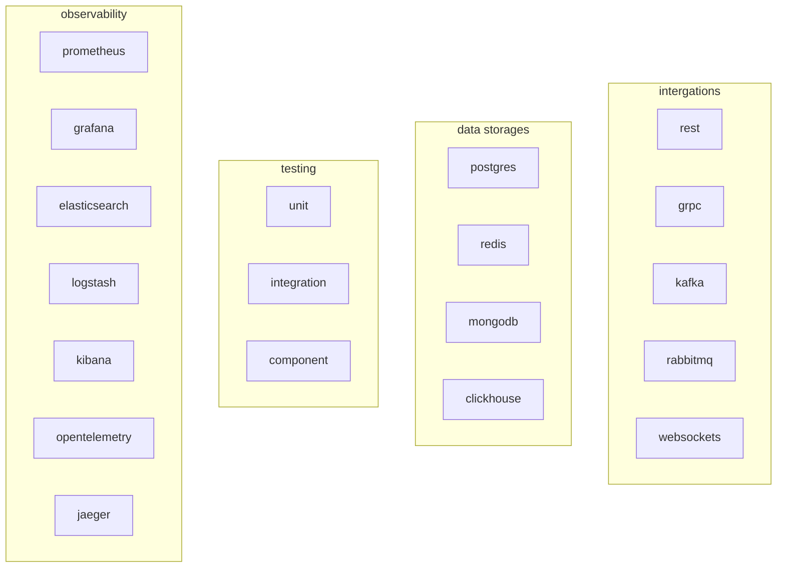

# Technologies

```mermaid
flowchart
    subgraph intergations
        A0[rest]
        A1[grpc]
        A2[kafka]
        A3[rabbitmq]
        A4[websockets]
    end

    subgraph data storages
        B0[postgres]
        B1[redis]
        B2[mongodb]
        B3[clickhouse]
    end

    subgraph testing
        C0[unit]
        C1[integration]
        C2[component]
    end

    subgraph observability
        D0[prometheus]
        D1[grafana]
        E0[elasticsearch]
        E1[logstash]
        E2[kibana]
        F0[opentelemetry]
        F1[jaeger]
    end
```
